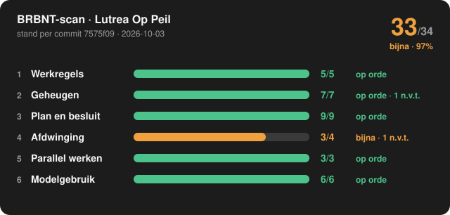

# BRBNT-scan: Lutrea Op Peil

**33 van 34 meetbare criteria gehaald (97%): 🟠 bijna** (±0)

Stand per commit [`7575f09`](https://github.com/marcovansteenbrugge/Lutrea-op-Peil/commit/7575f093ff228319c301a96214da2d371363e252) op `main`, gescand 2026-10-03 10:23 UTC. Criteria versie 5.
Vergeleken met de scan van 2026-10-02.

> **Het volledige dashboard:** open [dashboard.html](dashboard.html), kies "Download raw file" en open het bestand. Het werkt ook zonder internet.

## Per laag

| Laag | Score | Oordeel | Niet meegeteld | Groeien met |
|---|---|---|---|---|
| 1 Werkregels | 5/5 (±0) | 🟢 op orde | – | `brbnt-project-setup` |
| 2 Geheugen | 7/7 (±0) | 🟢 op orde | 1 n.v.t. | `brbnt-memory` |
| 3 Plan en besluit | 9/9 (±0) | 🟢 op orde | – | `brbnt-plan` |
| 4 Afdwinging | 3/4 (±0) | 🟠 bijna | 1 n.v.t., 3 niet te meten | `brbnt-skill-scaffold` |
| 5 Parallel werken | 3/3 (±0) | 🟢 op orde | 2 niet te meten | `brbnt-parallel-setup` |
| 6 Modelgebruik | 6/6 (±0) | 🟢 op orde | – | `brbnt-plan` |

Score per laag = gehaald ÷ (gehaald + niet gehaald). Alles gehaald is groen, vanaf 75% amber, daaronder rood.

## Nu van jou gevraagd

- [data-ontvangers-test](https://github.com/marcovansteenbrugge/Lutrea-op-Peil/blob/main/docs/data-ontvangers-test.beslis.md): B3 (vóór F3)

## Signalen

- 🔴 Actie: Plan data-ontvangers-test wacht op jou: B3 (vóór F3)

## Criteria

### Laag 1 · Werkregels: 5/5, op orde

| | # | Criterium | Bewijs |
|---|---|---|---|
| ✅ gehaald | 1.1 | CLAUDE.md staat in de root | CLAUDE.md, 74 regels |
| ✅ gehaald | 1.2 | Sectie "Plan en besluit" met de markering op de huidige versie (v1) | Markering brbnt-plan-regel: v1 gevonden |
| ✅ gehaald | 1.3 | Vereisten V1 tot en met V5 zijn aanwezig | V1 tot en met V5 aanwezig |
| ✅ gehaald | 1.4 | Minstens één regel wordt aantoonbaar afgedwongen | 4 van 23 regels noemen een bestaande test, hook of check |
| ✅ gehaald | 1.5 | Elke bewaking die CLAUDE.md noemt, bestaat ook | Alle 4 genoemde bewakingen in de repo bestaan |

### Laag 2 · Geheugen: 7/7, op orde

| | # | Criterium | Bewijs |
|---|---|---|---|
| ✅ gehaald | 2.1 | memory/MEMORY.md staat in de repo | memory/MEMORY.md is gecommit |
| ✅ gehaald | 2.2 | Index en map sluiten op elkaar, in beide richtingen | 4 bestanden, 4 indexregels |
| ✅ gehaald | 2.3 | Elke memory heeft name, description en een geldig type | Alle 4 compleet |
| ✅ gehaald | 2.4 | Geen kapotte [[links]] | Alle links wijzen naar een bestaande memory |
| ➖ n.v.t. | 2.5 | Elke feedback-memory heeft Why én How to apply | Geen feedback-memories |
| ✅ gehaald | 2.6 | Elke project-memory heeft een Why | Alle 3 met Why |
| ✅ gehaald | 2.7 | Elke memory noemt een datum als herkomst (user-memory uitgezonderd) | Alle 4 noemen een datum |
| ✅ gehaald | 2.8 | Het geheugen leeft: iets gewijzigd in de laatste 30 dagen | 4 memories gewijzigd in de laatste 30 dagen |

### Laag 3 · Plan en besluit: 9/9, op orde

| | # | Criterium | Bewijs |
|---|---|---|---|
| ✅ gehaald | 3.1 | Docs-map met plan-beslis-index.md | docs/plan-beslis-index.md |
| ✅ gehaald | 3.2 | Minstens één plan in het standaardformaat (plan + beslisdocument) | 2 plan(nen) |
| ✅ gehaald | 3.3 | De index en de statussen kloppen met wat sync berekent | sync (droogloop): niets aan te passen |
| ✅ gehaald | 3.4 | Elk genomen besluit heeft wie, wanneer en via wat | Alle 8 besluiten volledig vastgelegd |
| ✅ gehaald | 3.5 | Elke vrijgave heeft een naam, een tijdstip en een planversie | Alle 6 vrijgaven volledig |
| ✅ gehaald | 3.6 | Elke gebouwde fase haalt de toets-poort (plan.mjs toets) | 5 van 5 gebouwde fasen getoetst per criterium |
| ✅ gehaald | 3.7 | De planversie in de kop is de hoogste versie uit het wijzigingslog | Kop en wijzigingslog gelijk |
| ✅ gehaald | 3.8 | Commits voor planwerk dragen de fase-prefix uit het plan (F2: of CMS-F2:) | 14 commit(s) met een fase-prefix |
| ✅ gehaald | 3.9 | Niets wacht langer dan 7 dagen op de beslisser | 1 plan(nen) wachten, korter dan 7 dagen |

### Laag 4 · Afdwinging: 3/4, bijna

| | # | Criterium | Bewijs |
|---|---|---|---|
| ✅ gehaald | 4.1 | Er is een testsuite en die draait in CI | 2 testbestanden, workflow .github/workflows/tests.yml |
| ✅ gehaald | 4.2 | De laatste run op de hoofdtak is geslaagd | Run #34 geslaagd |
| ✅ gehaald | 4.3 | Minstens 90% van de laatste 30 runs is geslaagd (geannuleerd telt niet) | 30 van 30 geslaagd (100%) |
| ❔ niet te meten | 4.4 | Elk testbestand in de repo draait in CI | Geen CI-log met testbestanden om mee te vergelijken |
| ❌ niet gehaald | 4.5 | Minstens één bewakingstest (architectuur of drift) | Geen test met drift, parity, architectuur of conformance in de naam |
| ❔ niet te meten | 4.6 | Direct naar de hoofdtak pushen wordt tegengehouden | Geen pre-push-hook; branch protection bij GitHub wordt niet uitgelezen |
| ➖ n.v.t. | 4.7 | Uitrollen gebeurt alleen na een groene test | Geen uitroljob in CI |
| ❔ niet te meten | 4.8 | Alle skills die CLAUDE.md noemt, zijn beschikbaar | In CI zijn de skills van de ontwikkelaar niet te zien |

### Laag 5 · Parallel werken: 3/3, op orde

| | # | Criterium | Bewijs |
|---|---|---|---|
| ✅ gehaald | 5.1 | Er is een poortafspraak (addendum-parallel-ontwikkeling.md) | .claude/skills/brbnt-parallel-setup/assets/addendum-parallel-ontwikkeling.md.template |
| ✅ gehaald | 5.2 | De laatste 50 commits op de hoofdtak kwamen via een pull request, of CLAUDE.md legt vast dat direct op de hoofdtak mag | 28 van 28 direct op main, zoals vastgelegd in CLAUDE.md: "Alles gaat direct op main;" |
| ❔ niet te meten | 5.3 | Geen verweesde worktrees (zonder tak, of langer dan 14 dagen stil) | Worktrees staan op de machines van de ontwikkelaars; CI ziet ze niet |
| ✅ gehaald | 5.4 | Geen remote takken meer van al gemergde PR's | Geen achtergebleven takken |
| ❔ niet te meten | 5.5 | De dev-poorten volgen de poortformule | Poortformule vergelijken is nog niet gebouwd |

### Laag 6 · Modelgebruik: 6/6, op orde

| | # | Criterium | Bewijs |
|---|---|---|---|
| ✅ gehaald | 6.1 | Elke gebouwde fase heeft een uitvoeringsrij | 5 van 5 |
| ✅ gehaald | 6.2 | Niets geschat: elke meetwaarde is gemeten of staat als "onbekend" | 5 rijen, alle gemeten of "onbekend" |
| ✅ gehaald | 6.3 | Elke fase heeft een gepland model en effort | 8 fasen gepland |
| ✅ gehaald | 6.4 | Elke afwijking tussen gepland en gemeten effort staat in punt 12 | Geen afwijkingen tussen gepland en gemeten |
| ✅ gehaald | 6.5 | Fasen zijn behapbaar: geen enkele groter dan L | 8 fasen, grootste M |
| ✅ gehaald | 6.6 | Het onderzoek is apart vastgelegd (plan punt 3, of een onderzoeksdocument) | Alle plannen hebben onderzoek |

---

Gemaakt door de skill `brbnt-scan`. Dit bestand wordt automatisch vervangen; wijzig het niet met de hand.
